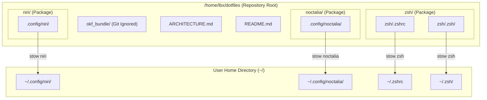

# System Architecture

This repository contains dotfiles for a Void Linux setup managed using **GNU Stow**. 

### How GNU Stow Package Subfolders Work
GNU Stow treats top-level directories in this repository (`niri/`, `noctalia/`, `zsh/`) as **packages**. When you run `stow <package>` from the repository root:
1. Stow looks **inside** the package folder (e.g., `zsh/`).
2. Stow **strips the package folder name** (`zsh/`) from the target path.
3. Stow creates symlinks in `$HOME` matching the relative structure inside that folder:
   - `~/dotfiles/zsh/.zshrc` $\rightarrow$ linked to `~/.zshrc`
   - `~/dotfiles/zsh/.zsh/` $\rightarrow$ linked to `~/.zsh/`
   - `~/dotfiles/niri/.config/niri/` $\rightarrow$ linked to `~/.config/niri/`

This subfolder pattern groups configuration files cleanly by application module while ensuring Stow places the symlinks directly in your home directory (`$HOME`).

## Workspace Map



---

## Core Directory Definitions

| Directory / File | Description |
| :--- | :--- |
| `niri/` | Configuration module for the **Niri** scrollable-tiling Wayland compositor (`.config/niri/config.kdl`, `noctalia.kdl`, custom scripts). |
| `noctalia/` | Configuration module for the **Noctalia** desktop shell (`.config/noctalia/settings.json`, `colors.json`, `plugins/`, `templates/`, `colorschemes/`). |
| `zsh/` | Shell configuration module containing `.zshrc` and plugin submodules (`zsh-autosuggestions`, `zsh-syntax-highlighting`). |
| `okf_bundle/` | Open Knowledge Format bundle containing auto-generated codebase index and metadata. Ignored in `.gitignore`. |
| `ARCHITECTURE.md` | Single source of truth for repository structure, architecture map, and key workflows. |

---

## Key Workflows

### 1. Module Deployment via GNU Stow
To link a module to `$HOME`, run `stow` from the repository root:
```bash
stow niri      # Symlinks niri/.config/niri -> ~/.config/niri
stow noctalia  # Symlinks noctalia/.config/noctalia -> ~/.config/noctalia
stow zsh       # Symlinks zsh/.zshrc -> ~/.zshrc and zsh/.zsh -> ~/.zsh
```

To un-link a module:
```bash
stow -D <module_name>
```

### 2. OKF (Open Knowledge Format) Maintenance
- **Regenerate Bundle**:
  ```bash
  okf generate .
  ```
- **Incremental Update**:
  ```bash
  okf update .
  ```
- **Lookup Context**:
  ```bash
  okf lookup <query>
  ```

### 3. Modifying Configurations
1. Edit files directly in the repository directory (e.g., `niri/.config/niri/config.kdl`).
2. Changes automatically reflect in `$HOME` via Stow's symlinks.
3. Test changes in the running compositor/shell or reload configs (e.g., Niri config live-reloads).
4. Run `okf update .` post-modification to update OKF context index.
